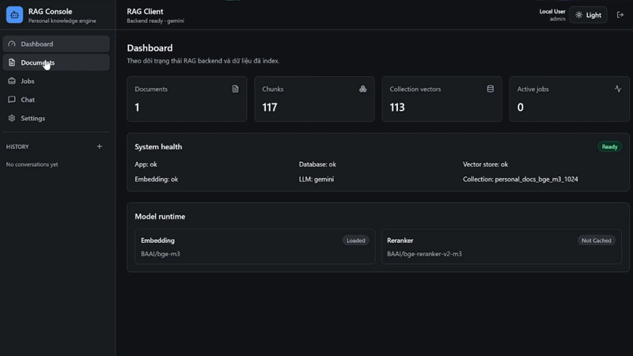

# RAG Chatbot

A personal Retrieval-Augmented Generation (RAG) application with a FastAPI backend and a React frontend.

It supports document upload and question answering over PDF, DOCX, TXT, Markdown, URL/HTML, and OCR image files.

## Requirements

- Python 3.11
- Node.js 20+
- Tesseract OCR
- Gemini API key
- Docker Desktop, optional

## Local Setup

Install the backend:

```powershell
git clone <your-repository-url>
cd RAG-chatbot
py -3.11 -m venv .venv
.\.venv\Scripts\Activate.ps1
python -m pip install --upgrade pip
pip install -r requirements.txt
Copy-Item .env.example .env
```

Update `.env`:

```env
GEMINI_API_KEY=your_key_here
TESSERACT_CMD=path_to_tesseract_executable
OCR_LANGUAGES="eng+vie"
DEFAULT_MIN_SCORE=0.76
AUTH_ENABLED=false
```

Install the frontend:

```powershell
cd frontend
npm install
Copy-Item .env.example .env
```

Update `frontend/.env`:

```env
VITE_API_BASE_URL=http://127.0.0.1:8000
VITE_AUTH_MODE=disabled
```

## Run Locally

Terminal 1:

```powershell
cd RAG-chatbot
.\.venv\Scripts\Activate.ps1
.\.venv\Scripts\python.exe -m uvicorn app.main:app --reload --host 127.0.0.1 --port 8000
```

Terminal 2:

```powershell
cd RAG-chatbot\frontend
npm run dev
```

Open:

```text
http://127.0.0.1:5173
```

## Run With Docker

```powershell
cd RAG-chatbot
Copy-Item deploy\docker.env.example deploy\docker.env
```

Update `deploy/docker.env`:

```env
GEMINI_API_KEY=your_key_here
DEFAULT_MIN_SCORE=0.76
```

Build and start:

```powershell
docker compose build
docker compose up -d
```

Open:

```text
http://127.0.0.1:8080
```

Useful commands:

```powershell
docker compose ps
docker compose logs -f backend
docker compose down
```

## Health Check

```powershell
Invoke-RestMethod http://127.0.0.1:8000/health
```

API docs:

```text
http://127.0.0.1:8000/docs
```

## Test And Build

Backend tests:

```powershell
cd RAG-chatbot
.\.venv\Scripts\python.exe -m pytest -q
```

Frontend build:

```powershell
cd RAG-chatbot\frontend
npm run build
```

## Retrieval Benchmark

```powershell
cd RAG-chatbot
.\.venv\Scripts\python.exe -m app.cli.benchmark --dataset benchmarks\sample_retrieval.jsonl --strategies parent_child,dense --top-k 3 --fetch-k 8 --min-score 0.76 --page-tolerance 1 --auto-source-filter --local-files-only --show-failures
```

## End-to-End RAG Benchmark

Run the first 5 questions:

```powershell
cd RAG-chatbot
.\.venv\Scripts\python.exe -m app.cli.rag_benchmark --dataset benchmarks\sample_retrieval.jsonl --strategies parent_child --top-k 3 --fetch-k 8 --min-score 0.76 --auto-source-filter --temperature 0 --max-tokens 2048 --request-delay-seconds 13 --offset 0 --limit 5 --local-files-only --show-failures
```

Run the next 10-question batch:

```powershell
.\.venv\Scripts\python.exe -m app.cli.rag_benchmark --dataset benchmarks\sample_retrieval.jsonl --strategies parent_child --top-k 3 --fetch-k 8 --min-score 0.76 --auto-source-filter --temperature 0 --max-tokens 2048 --request-delay-seconds 13 --offset 10 --limit 10 --local-files-only --show-failures
```

Gemini free tier is rate-limited. If you get `429`, increase `--request-delay-seconds` to `15` or `20`.

## Demo


